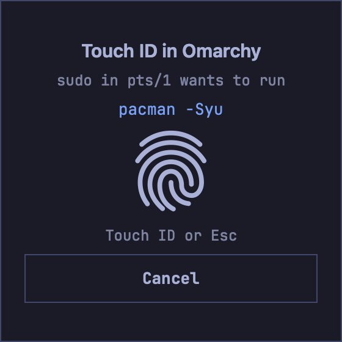

# 0041: Touch ID in the VM: the Mac answers yes or no to the VM's own PAM

Status: accepted (`touch-id`, for 3.0.2). Built for Parallels, UTM and
VMware Fusion; OmacVM.app's auth port is still to do (see Built, below).

## Context

In Omarchy, sudo, polkit prompts and 1Password's "Unlock using system
authentication" all ask for the Linux password. The Mac next to it has Touch
ID. The wish: touch the Mac's sensor instead of typing.

How the guest side asks today:

- sudo runs PAM service `sudo` (`auth include system-auth` on Arch).
- polkit runs PAM service `polkit-1` in `polkit-agent-helper-1` (a setuid
  helper, or a socket-started root service from polkit 126). Omarchy's
  polkit agent only shows the dialog; the helper does the PAM work. Arch's
  polkit 127 (checked in a VM): the socket-started helper, in a systemd
  sandbox without network (`PrivateNetwork=yes`,
  `RestrictAddressFamilies=AF_UNIX`), and its PAM file only in
  `/usr/lib/pam.d/polkit-1`.
- 1Password for Linux registers `com.1password.1Password.unlock` in
  `/usr/share/polkit-1/actions/com.1password.1Password.policy`
  (`allow_active` = `auth_self`, so polkit never caches the answer). The
  app asks polkit, polkit asks the agent, the helper runs `polkit-1`. So
  anything that answers in `polkit-1` also unlocks 1Password, and the
  1Password CLI and SSH agent prompts that use the same file. 1Password
  still wants its own password on its first unlock after it starts; that is
  1Password's rule, not ours.

How the Bridge knows a VM (ADR 0031): every VM has the shared Bridge token
and checks `/proof` first; requests under `/omacvm/` are also signed with
the VM's own key (HMAC, time, nonce, protocol header, body hash), and the
answer is signed back (`X-OmacVM-Answer`). The Bridge finds the VM from the
peer address in `omacvm vms --json` and the key on the Mac in
`omacvm/vm-keys/`. OmacVM.app's VMs go through the app's relay with the
relay key; the app names the VM. The control centre's key is in the
desktop user's home (`~/.config/omacvm-bridge/vm-key`), readable by every
program of that user.

## Options

PAM side:

1. A C PAM module (`pam_omacvm_touchid.so`). Full control over the
   conversation and timeouts, but a compiled module in every PAM stack,
   built for aarch64 in the VM, and a crash takes sudo with it.
2. `pam_exec.so` and a small client program. Stock PAM, nothing compiled
   into the stack; the client is a separate process, so a hang or crash is
   just "no". `pam_exec` has no timeout of its own and a bare environment,
   so the client sets its own `PATH` and timeouts.
3. `pam_fprintd` with a fake fingerprint reader. Wrong layer, no.

Key:

1. Reuse the control centre's `vm-key`. Any program of the desktop user
   could then sign Touch ID requests and put up Mac dialogs at will.
2. A separate Touch ID key, root only in the VM. Only PAM (root) can ask.

## Decision

pam_exec + client (option 2), a separate root-only key (option 2), one new
signed request on the Bridge, behind a new feature `touch-id`
(experimental, off by default, `mac,vm`, all routes the Bridge serves:
OmacVM.app, Parallels, UTM, VMware Fusion).

### Guest

- Client `/usr/lib/omacvm/omacvm-touchid` (Python, run with `-I`; runs as
  root; see Built for why not bash + curl + openssl).
- Key `/etc/omacvm/touchid-key` (root, 0600), made by `omacvm apply` when
  the feature goes on; the Mac keeps its copy as
  `omacvm/vm-keys/<vm>.touchid`. Off: both deleted, so a VM that kept its
  PAM lines gets 403 and falls to the password.
- PAM: one line at the top of `auth` in `/etc/pam.d/sudo`, `sudo-i` (where
  it exists) and `polkit-1` only, before `auth include system-auth`. A
  service with only the vendor's file (`/usr/lib/pam.d/polkit-1`) gets a
  copy in `/etc/pam.d` with the line; off removes the copy, so the vendor's
  file counts again:

  ```
  auth sufficient pam_exec.so quiet seteuid stdout /usr/lib/omacvm/omacvm-touchid
  ```

  `sufficient`: a yes ends auth; any failure is ignored and the password
  prompt follows as before. `seteuid`: without it the client runs with the
  caller's real uid and bash drops root. `stdout`: the client's one line
  shows as a PAM info message (in the terminal for sudo, in the agent's
  dialog for polkit).
  Never in `system-auth`, `login`, `sshd`, `su` or the lock screen
  (`hyprlock`). The lock screen may come later as its own switch.
- polkit's helper sandbox (polkit 127): a drop-in
  (`polkit-agent-helper@.service.d/omacvm-touchid.conf`) allows `AF_INET`
  with `IPAddressDeny=any` and `IPAddressAllow=<the Bridge's address>`, so
  the helper reaches the Mac's Bridge and nothing else. Without it the
  client cannot connect and polkit always asks for the password.
- Only the person at the VM's screen. The client asks only when all hold,
  else it exits 1 at once (logind via `loginctl`):
  - `PAM_USER` is a person (uid 1000 or more, never root) and owns the
    active, local display session on a seat (`show-user -p Display`:
    `Remote=no`, `Active=yes`, a seat, class `user`). So polkit's
    `auth_admin` for a user outside wheel (identity root or another admin)
    and sudo with `rootpw`/`targetpw` never ask.
  - The caller's own login session (the audit session of sudo, or of a
    setuid polkit helper) is not remote and is this user's: on a seat, or
    the user's service manager (class `manager`: Omarchy starts Hyprland
    through uwsm, so every terminal runs under `user@<uid>.service`, audit
    session = the manager's). An SSH login, a cron job (class
    `background`), an audit session logind does not know (cronie sets
    one) or another user's session: no. No audit session at all (polkit
    127's socket-started helper) leaves it to the display session.
  - sudo: `PAM_TTY` is a terminal (`pts/N`, `ttyN`) the user owns. `sudo
    -n` from a program in the background has none and never reaches the
    Mac. The terminal goes into the dialog text.
  - polkit: the polkit rule noted a check for this user less than 5 s ago
    (see below).
  Someone logged in over SSH as another user never puts a dialog on the
  Mac. Logged in over SSH as the same user, `systemd-run --user --pty sudo`
  runs under the user's service manager and can: that is the user's own
  programs (Consequences), not a new boundary.
- What the request says (descriptive only; the guest can lie, and only
  about itself):
  - sudo: `kind: "sudo"`, the command from `/proc/<sudo pid>/cmdline`
    (sudo is setuid, the caller cannot change it after exec) and `tty`.
    Only a command the dialog can show whole and honestly: a `NAME=value`
    word anywhere (sudo allows `sudo LD_PRELOAD=... pacman`; padding in
    front would push it out of sight) or more than 120 characters: no
    Touch ID, the password, and the client says why. Anything but plain
    ASCII is shown as `?`, never dropped.
  - polkit: PAM has no action id. A polkit rule
    (`/etc/polkit-1/rules.d/00-omacvm-touchid.rules`, `00-` so it runs
    before any rule that answers) notes each check of a local, active
    subject with `polkit.spawn` of a small sh writer
    (`omacvm-touchid-note`, about 5 ms) as one line `<time> <action>`
    added to `/run/omacvm-touchid/<user>` (polkitd's folder, 0700), and
    returns `NOT_HANDLED`, so polkit's own decision stays. The client
    reads the last 15 s, leaving out actions whose own file says an active
    user is never asked (`allow_active` `yes` or `no`: the desktop checks
    those all the time). No such note under 5 s old: no Touch ID (the
    password). Exactly one action in the 15 s: `com.1password.*` becomes
    `kind: "1password"`, anything else `kind: "polkit"` with the action
    id. More than one: `kind: "polkit"` without an action ("allow a system
    request"). So a program that runs `pkexec` and then a harmless
    `pkcheck --action-id com.1password.1Password.unlock` gets the generic
    text, never "unlock 1Password". An action made to ask by a local rule
    although its file says `yes` gets no note that counts: the password.
- Transport: Parallels, UTM, Fusion: TCP to the Bridge as today (`/proof`,
  token, then the signed request). OmacVM.app: a new virtio port
  `org.omacvm.auth`, root 0600 by udev rule, so the control centre's port
  (one opener, held up to 60 s by status requests) never blocks a sudo.
  The app relays it like `org.omacvm.control`.
- Timeouts in the client: 1 s to connect, 35 s for the answer, and one
  deadline of 40 s for the whole request (a "Bridge" that drips a byte at a
  time cannot hold sudo or the agent), then exit 1. Ctrl+C in sudo kills
  the client; the agent's Cancel kills the helper, and the client, which
  watches its parent, stops too; either way the closed connection cancels
  the Mac dialog.

### Request and answer

`POST /omacvm/touchid`, signed as in ADR 0031 but with the Touch ID key
and its own label (`"omacvm-touchid-request 1\n"` ...), so a control
centre signature never counts here and the other way round. Body, strict
JSON, at most 1 KB, unknown keys refused:

```json
{"kind": "sudo" | "polkit" | "1password", "user": "vincent",
 "detail": "pacman -Syu", "tty": "pts/3",
 "action": "org.freedesktop.systemd1.manage-units"}
```

`user` is `[A-Za-z_][A-Za-z0-9_.-]{0,31}` and never `root`; `tty` is
`pts/N` or `ttyN`; `detail` up to 200 bytes, `action` up to 128
(`[A-Za-z0-9._-]`). The Mac turns control, bidi, invisible and unusual
space characters into one plain space (for a client that is not ours) and
cuts `detail` at 120 characters with "… (cut)" (ours never sends longer).

Answer, signed with `X-OmacVM-Answer` (nonce, status, body hash):

```json
{"result": "yes"}
{"result": "no", "reason": "cancelled" | "failed" | "timeout" | "busy"
   | "rate" | "locked" | "not-front" | "no-touch-id" | "lockout" | "off"}
```

The client exits 0 only on a 200 with `result: "yes"`, a valid answer
signature and its own nonce. Everything else, including an unsigned answer
or no answer, is exit 1 (password). The one unsigned answer it reads is a
403 `off` (no key on the Mac, so it cannot sign), and only to say "Touch ID
off".

### Mac (Bridge, `touchid.swift`)

- Only VMs this Mac's OmacVM set up: the VM found as for `/omacvm/`
  (address or app relay) must have a Touch ID key on the Mac and the
  feature on. Unknown VM, no key, bad signature: 403, no dialog.
- Fast no, before any dialog: feature off (`off`), Mac screen locked or
  display asleep (`locked`), the VM's app (OmacVM.app, Parallels, UTM,
  Fusion) not the frontmost app (`not-front`), `canEvaluatePolicy` false:
  no sensor, no finger enrolled, lid closed without a Touch ID keyboard
  (`no-touch-id`), too many failed tries (`lockout`).
- The dialog: a fresh `LAContext` per request, never reused or kept
  (`touchIDAuthenticationAllowableReuseDuration` 0), invalidated at the
  end. Policy `.deviceOwnerAuthenticationWithBiometrics` with no fallback
  button (`localizedFallbackTitle = ""`). The Mac password as fallback
  only when the person turns on `touch_id_password_fallback` in the
  Bridge's `config.json` (then `.deviceOwnerAuthentication`).
- One dialog at a time on the Mac (`busy` for the next one). Per VM: one
  request every 2 s, 10 a minute; after 3 misses in a row (`cancelled`,
  `failed` or `timeout`) a pause of `rate`: 60 s, then 5 min, then 30 min,
  until a yes. So a VM that keeps dialogs up for nobody stops after three.
  A dialog not answered in 30 s is invalidated (`timeout`); a client that
  disconnects invalidates it too.
- The Mac's state (screen locked, app in front) is read on the main thread.
- Nothing about the finger leaves the Mac: macOS gives the Bridge only
  success or an error code, and the VM only gets yes or no.
- Log: one line per request (VM, kind, result, never `detail`); refusals
  and the fast `rate`/`busy` noes at most once a minute per kind.

### Texts

macOS shows: "OmacVM Bridge is trying to <reason>. Touch ID to allow this."
So the reason starts with a verb:

| kind | reason |
|---|---|
| `1password` | `unlock 1Password in Omarchy` |
| `sudo` | `run sudo in Omarchy (pts/3): <command>` |
| `polkit` with action | `allow "<action id>" in Omarchy` |
| `polkit` without | `allow a system request in Omarchy` |

With several VMs set up, " (<VM name>)" follows "Omarchy" (for sudo:
"Omarchy (<VM name>, pts/3)").
In the VM, the client's one line (PAM info):

- asking: `Touch ID on your Mac, or wait for the password prompt`
- fast no: `Touch ID not available (<why>), use your password`, why from
  the reason: `Mac locked`, `VM not in front`, `no Touch ID`, `too many
  tries`, `Touch ID off`, `VM clock off`. Silent for
  `cancelled`/`failed`/`timeout`; the password prompt is the message.
- a sudo command it does not send: `Touch ID not used for this command
  (too long or sets variables), use your password`

Control centre and CLI: the row "Touch ID" with "Unlock 1Password, sudo
and system prompts with the Mac's Touch ID. Your password keeps working."
`omacvm enable touch-id`, `omacvm disable touch-id`. `omacvm check`
reports: the keys in the VM, the PAM lines, the polkit rule and its note
writer. Not yet: a row in `omacvm check --mac-only` (key on the Mac,
sensor) and the last result.

## Consequences

- A yes protects only the VM's own boundary, the same as the VM password:
  it never unlocks anything on the Mac, and macOS asks again every time.
  Anyone who has root in the VM has the key and can ask for dialogs; a
  yes then gives them nothing they did not have.
- The desktop user's programs cannot ask directly (no key), but they can
  run `sudo` or `pkexec` and so put up a dialog. Without a terminal they
  could not pass sudo before, and with Touch ID they still cannot reach
  the Mac (no `PAM_TTY` of the user's: password). A program can open a
  terminal of its own (a new pty is the user's) and run sudo in it; the
  dialog then names that terminal ("pts/7") and the command. What the text
  can prove: the command sudo was started with, whole, and the terminal
  number. What it cannot: that the person typed it. The "VM in front" rule
  keeps dialogs from appearing while the person does something else on the
  Mac, and a dialog the person did not expect is a reason to cancel.
- The sudo command goes to whoever passes `/proof`: any VM with the Bridge
  token that takes the Mac's address can read it (it gets no yes). Do not
  put secrets on sudo's command line (that holds without Touch ID too).
- `touch_id_password_fallback` (`.deviceOwnerAuthentication`) also
  accepts an Apple Watch's approval and the Mac's password, as macOS does.
- polkit's helper may use the network to the Bridge's address (the
  drop-in above); polkit's other sandboxing stays.
- Another VM on the same network can answer in the Mac's place (ADR
  0031's impostor case), but cannot sign: the answer is a no.
- The password always works. Mac asleep: the VM is paused anyway; Mac
  locked, no sensor, Bridge not running, network down: the client says
  no within about a second and the password prompt comes.
- pam_faillock stays in `system-auth`, after our line: a Touch ID yes
  passes even while faillock locks the password. Accepted: faillock stops
  password guessing, and a Touch ID yes is not a guess.
- Tests: the Bridge's Touch ID decisions behind a protocol with a mocked
  `LAContext` (yes, no, error codes, timeout, disconnect, rate, busy); the
  client and PAM stack in a test VM against a mock Bridge (sudo,
  `pkexec true`, a polkit action standing in for 1Password; remote session
  refused; Bridge down falls to the password in under 2 s). One manual
  check with a real finger, by the person, on a Mac with Touch ID.

## Built

- Mac: `src/bridge/mac/touchid_policy.swift` (request, texts, limits, the
  order of the checks) and `touchid.swift` (LocalAuthentication, the Mac's
  state, the request). `control.swift` finds the VM and checks the
  signature (`touchIDCaller`); `requestMAC`, `answerMAC` and
  `verifyControlAuth` take the label.
- VM: `src/bridge/guest/omacvm-touchid` (the PAM client; Python, run with
  `-I`, not bash + curl + openssl: no key or token in any process's
  arguments, and the timeouts in one place), `touchid.sh on|off` (the PAM
  lines, the polkit rule `49-omacvm-touchid.rules`, `/run/omacvm-touchid`
  through tmpfiles, owned by `polkitd`), `guest/install.sh` and
  `omacvm check`. The polkit rule notes the action by user name (polkit
  gives rules no uid).
- Keys: `omacvm apply` makes `vm-keys/<vm>.touchid` (`touchid_key_ensure`)
  and puts it and the Bridge token in `/etc/omacvm` (root, 0600); off: the
  Mac's copy goes in apply, the VM's in `touchid.sh off`.
- The feature is on for a VM exactly when its Touch ID key is on the Mac:
  no key, 403 `off`, no dialog.
- Tests: `src/bridge/mac/tests/run.sh` (LAContext and the Mac's state
  mocked: request shapes, texts, every fast no, rate, pause after misses,
  busy, timeout, client gone, labels kept apart) and
  `src/tests/touchid-client.sh` (the client against a fake Bridge: yes, each
  no, unsigned, other key, other nonce, Bridge without the token, another
  PAM service, SSH, no key, polkit notes, Bridge down under 2 s; PAM lines
  in and out byte for byte). Both in CI.

- Review fixes (Fable 5.1, 2026-10-06): label only for a single noted
  action (H1); the display session and the caller's session from logind,
  uwsm terminals included (H2, M1, M5); sudo only from a terminal of the
  user's, named in the dialog (H3); no cut or `NAME=value` commands, `?`
  for non-ASCII, more characters cleaned on the Mac (M3); one 40 s
  deadline (M2); timeouts count as misses, growing pauses (M4); the
  smaller ones (main thread, fast noes in the log, unsigned `off`, `VM
  clock off`, `sudo-i`, user names with dots, the client stops with its
  caller, a sh note writer).
- Test VM pass (2026-10-06, OmacVM.app test VM on the MacBook Pro, Arch
  ARM: sudo 1.9.17p2, polkit 127, systemd 262, Hyprland 0.56 through uwsm;
  the real PAM stacks and polkit, a stand-in Bridge on 127.0.0.1 in the
  VM, no Touch ID dialog anywhere): sudo in a foot terminal started as
  Omarchy starts it (uwsm app): Touch ID asked, `{"kind":"sudo",
  "detail":"true","tty":"pts/0"}`, let in, 47 ms; `pkexec true`: asked
  (`org.freedesktop.policykit.exec`), let in, 98 ms; a stand-in
  `com.1password.1Password.unlock` (`allow_active` `auth_self`) through
  `pkcheck --allow-user-interaction`: `kind "1password"`, let in; right
  after a pkexec, the generic text. Over SSH: sudo and pkexec never ask
  (password prompt at 55 ms and 105 ms). `systemd-run --user sudo -n`:
  never asks. Bridge down: sudo's password prompt at 66 ms, polkit's
  client done 82 ms after pkexec started; a Bridge address that does not
  answer: 1.08 s. Without the helper drop-in, pkexec never reached the
  stand-in (the sandbox). The polkit rule costs about 5 ms per check of a
  local subject (11 ms against 6 ms).

Still to do:

- OmacVM.app: the `org.omacvm.auth` virtio port and its relay in the app.
  Until then the client says "Touch ID not available (OmacVM.app: not
  yet)" on the app's VMs and the password prompt comes.
- The manual check with a real finger (the person, on a Mac with Touch ID,
  a Parallels, UTM or Fusion VM): `omacvm enable touch-id`, then in an
  Omarchy terminal `sudo -k; sudo true` (Touch ID dialog "run sudo in
  Omarchy (pts/N): true", touch: no password); again and Cancel on the Mac
  (the password prompt); `pkexec true` (dialog "allow
  "org.freedesktop.policykit.exec" in Omarchy", touch); the Mac locked or
  another app in front (password at once); 1Password's "Unlock using
  system authentication" after its first unlock ("unlock 1Password in
  Omarchy").

## Addendum (3.0.2): the Mac's own Touch ID panel

Status: built (`touch-id-panel`, 2026-10-06; "Built" at the end of this
addendum). The feature stays
opt-in and off by default; this only changes what the Mac shows once it is on.



### What

Instead of macOS's generic "OmacVM Bridge is trying to ..." alert, the Bridge
shows its own panel, drawn by the Mac in the VM's Omarchy theme, laid out like
Apple's Touch ID panel: the OmacVM icon, "Touch ID in Omarchy", one plain line
saying what asks, the verified command or action in a mono box, Apple's
embedded Touch ID view in the middle, "Touch ID to allow", Cancel. It looks
like Omarchy's own polkit prompt and OSD: the theme's background, text,
accent and border colours, a 2 pt border, Hyprland's corner rounding (0 in
the default themes), JetBrains Mono.

### Where it lives: the Bridge

`LAAuthenticationView` shows the prompt for the `LAContext` it was made with,
in the same process. The Bridge already makes that context, decides and
signs, for every route (Parallels, UTM, Fusion, OmacVM.app through the app's
relay), so the panel lives in the Bridge (`touchid_panel.swift`) and nothing
else changes in the request path: `TouchIDDecider` calls a new
`TouchIDAuthenticator` (`LAPanelTouchID`) instead of `LATouchID`. OmacVM.app
gets no panel code of its own; its VMs reach the same panel once the
`org.omacvm.auth` port and its relay exist (Built, still to do). The panel
draws its own icon and title, so the process name ("OmacVM Bridge") never
shows; in the fallback alert it does, as today.

### Apple's embedded view (checked in the macOS 26.2 SDK headers)

- `LocalAuthenticationEmbeddedUI.LAAuthenticationView`, AppKit, macOS 12+
  (the Bridge needs 13). `init(context:controlSize:)`; when
  `evaluatePolicy` is called on that context, the UI shows in the view
  instead of the alert.
- It shows no text, only the Touch ID (or Watch) glyph. Apple: "the reason
  must be apparent from the surrounding UI". That is our panel's job.
- Policies: `.deviceOwnerAuthenticationWithBiometrics` (ours), the
  companion ones, and `.deviceOwnerAuthentication` "for convenience" only:
  it fails when neither Touch ID nor a Watch can be used. So the Mac password
  never works in the view.
- SwiftUI's `LocalAuthenticationView` (macOS 13+) wraps the same thing; we
  use the AppKit view (the Bridge is AppKit).
- Order: build the panel with the view, show it, then `evaluatePolicy`.
  `localizedReason` is still passed (today's reason text; macOS needs one).
- Not knowable from the headers, to check on the MacBook Air: that the view
  works in a non-activating panel of an accessory (LSUIElement) app, and
  with the lid closed and a Magic Keyboard with Touch ID.

### Fallback to macOS's alert (today's dialog, unchanged)

The panel is used only when all hold, else the alert, with the same reason
text and the same rules:

- `touch_id_password_fallback` is off (the Mac password needs the alert).
- `touch_id_panel` in the Bridge's `config.json` is not `false` (escape
  hatch; default on).
- The VM's window is found on a screen (below). Not found: the alert.
- The embedded view has not failed before in this Bridge run. If
  `evaluatePolicy` ends within 0.5 s with an error other than a cancel,
  lockout or "not available" (the view could not show), the Bridge logs it
  once and uses the alert for this request and every later one until it
  restarts. A request is never asked twice after the person could have seen
  a prompt.

No sensor, no finger enrolled, lid closed without a Touch ID keyboard: the
fast `no-touch-id` as today, no panel and no alert.

### Placement

Read on the main thread, no Screen Recording needed (only window bounds,
owner and layer from `CGWindowListCopyWindowInfo`):

1. The front app's pid (it must be the VM's app already: `not-front`).
2. Its frontmost on-screen window at layer 0, at least 200x150 pt.
3. The screen holding most of that window.
4. Windowed: centred on the window, its top 22 % down the window (at most
   180 pt), kept inside the screen's visible frame.
5. Full screen (the window fills the screen) on a screen with a notch
   (`safeAreaInsets.top > 0`): a card hanging from the strip, centred on the
   notch, square top, rounded bottom, sliding down; it sits right under
   Omanotch's strip panel.

Panel: `NSPanel`, borderless, `.nonactivatingPanel`, level 28 (Omanotch's
strip is 27, Parallels' and UTM's strip windows 26), `.fullScreenAuxiliary,
.moveToActiveSpace, .ignoresCycle, .transient`, not movable, opaque, a shadow
when windowed. It may become key without activating the Bridge, so Esc and
⌘. reach it and typing does not go on into the VM while it is up; when it
closes, the VM's window has the keyboard again. `appearance` follows the
theme (dark or light), so Apple's glyph matches the background.

### The words

Only from the request the Bridge parsed and verified (`TouchIDRequest`),
cleaned by `touchIDClean` exactly as for `touchIDReason`; never from the
theme:

| kind | line | box |
|---|---|---|
| `sudo` | `sudo in pts/3 wants to run` | the command (up to 120 characters, whole, wrapped by character, never cut) |
| `polkit` with action | `Allow a system request` | the action id |
| `polkit` without | `Allow a system request` | none |
| `1password` | `Unlock 1Password` | none |

Title: "Touch ID in Omarchy", with " (<VM name>)" when more than one VM is set
up (the name from the Mac's own VM list, as today). A test checks that the box
holds exactly the text `touchIDReason` puts after its colon (or the action
in its quotes), so the panel and the alert can never say different things.

### The theme

Source in Omarchy 4 (checked in a 4.0.3 VM): the current theme is
`~/.local/state/omarchy/current/theme/` (`theme.name` next to it).
`colors.toml` holds the palette (`mode`, `background`, `foreground`,
`accent`, `red`, ...; all 22 stock themes have them). `shell.toml` is the
shell's file generated from it (or shipped by the theme); its `[polkit]`
section is what Omarchy's own password prompt draws with: `background`,
`text`, `accent`, `text-error`, `border = "hyprland.active-border"`. The
shell's corner radius is Hyprland's `decoration:rounding` and its border the
live `general:col.active_border` (a colour or a gradient), both read with
`hyprctl getoption`.

Guest: `omacvm-touchid-theme` (installed by `touchid.sh on`, removed by
off) reads `[polkit]` from `shell.toml` (falling back to `colors.toml`),
`hyprctl -j getoption decoration:rounding` and `general:col.active_border`,
and sends them signed with the VM's control key, through the control
centre's client (TCP or `org.omacvm.control`):

```json
POST /omacvm/theme
{"background": "#1a1b26", "foreground": "#a9b1d6", "accent": "#7aa2f7",
 "error": "#f7768e", "border": ["#7aa2f7"], "border_angle": 0, "radius": 0}
```

It runs from a user path unit on `~/.local/state/omarchy/current` (as
`omacvm-wallpaper.path`) and once at login. (Omarchy's `theme-set` hook was
planned too; the path unit already fires on every theme change, so it is
not used.) No control key in the VM, or the port busy: retried at the next
change; the panel meanwhile uses the last theme or Tokyo Night.

Mac: `/omacvm/theme` only for a VM with its Touch ID key on the Mac (else
403 `off`), strict JSON, at most 512 bytes, known keys only, one a second per
VM. Kept per VM as `touchid-theme/<vm key>.json` (0600) in the Bridge's
folder, deleted with the VM's Touch ID key. Rules, so the reason stays
readable whatever a VM sends:

- Colours `#rrggbb` only; alpha is never the guest's (the card is opaque).
- `foreground` on `background` at least 4.5:1 (WCAG), else the whole theme
  is refused and the last good one (or Tokyo Night) stays. All 22 stock
  themes pass (lowest: rose-pine 6.7:1).
- `accent`, `error` at least 3:1, a border colour at least 1.5:1, else the
  text colour (accent) stands in. At most 2 border colours; an angle.
- `radius` clamped to 0...12 pt.
- Font: always the bundled JetBrains Mono (OFL 1.1, in
  THIRD_PARTY_NOTICES), never a family the guest names (a symbol font could
  hide the command).
- Light or dark comes from the background's luminance, not from `mode`.
- The softer second lines and the command box's fill are moved back to
  4.5:1 when a theme only just passes; with Increase Contrast they use the
  text colour itself.

### Security

- Drawn by the Mac only; the guest sends colours and a radius, nothing it
  sends is shown as text except the verified request fields above.
- Nothing in the panel can say yes: only a finger on the sensor does, inside
  Apple's view. Cancel, Esc, ⌘. and closing all cancel. Return does nothing
  (no default button). So a click or key the guest could cause on the Mac
  (Gestures' hotkeys, the Bridge's media keys, both marked with OmacVM's
  event marker) can at most cancel, and the panel also ignores events with
  that marker.
- One panel at a time (`busy`, as today). It closes when the VM's client goes
  away (Ctrl+C in sudo, the agent's Cancel), on the 30 s timeout, when the
  Mac locks or the display sleeps, and when another app comes to the front
  (`not-front`, not a miss).
- It cannot be moved or placed by the guest: position comes from the Mac's
  window list only.
- Cancel stops the evaluation at once and wins over a finger that matches in
  the same moment.
- The command never draws outside its box (stacked combining marks cannot
  cover the title or the hint).
- VoiceOver: the panel is a dialog with its title; its words and "Touch ID
  to allow" are announced when it shows, since the Bridge never becomes the
  active app. Reduce Motion: the notch card shows without sliding.
- Several VMs of the same app: the panel goes over the front window of the
  app in front, which may be another VM's, drawn in the asking VM's colours.
  The title names the asking VM (as the alert does); that name is what to
  read.

### Tests

- Swift, no macOS UI: theme parsing and every sanitizer rule (fixtures: the
  22 stock `colors.toml` and the Tokyo Night `shell.toml`), panel text per
  kind against `touchIDReason`, placement maths (windowed, full screen with
  and without a notch, window on a second screen, window not found ->
  alert), the panel's state (showing, cancelled by button/Esc/client gone/
  timeout/lock/front change, closed once).
- Snapshots of the real panel view drawn off screen (dark, light, long
  command, rounded with a gradient border, notch card) as PNGs in
  `~/omacvm-work/touchid-panel/`.
- MacBook Pro (where the person works): a mock authenticator with a stand-in
  view, the panel never ordered on screen, no `LAContext` made.
- MacBook Air (Touch ID, notch, test identity): the panel shows over a test
  VM windowed and full screen, Cancel, Esc, timeout, Ctrl+C in the VM. The
  finger check is for the person.

### Built (2026-10-06)

- Mac: `touchid_theme.swift` (the theme's rules and the Mac's copy),
  `touchid_panel_model.swift` (words, placement, keys, panel or alert, one
  end), `touchid_panel.swift` (the view, the window, `TouchIDPanelFlow`),
  `LAPanelTouchID` in `touchid.swift`, `POST /omacvm/theme` in
  `control.swift`. The flow takes the LocalAuthentication parts as
  closures, so the same code runs with a mock.
- Apple's view pins its own size: 16, 32, 64 or 128 pt for mini, small,
  regular and large, and draws at that size whatever frame it gets (at
  `.large` it spilled out of the panel on the Air). The panel uses
  `.regular` in a 64 pt slot.
- Guest: `omacvm-touchid-theme` with `omacvm-touchid-theme.path` and
  `.service` (user units, from `touchid.sh on <user>`), a row in `omacvm
  check`; `omacvm apply` removes the Mac's copy with the Touch ID key.
- Tests: `tests/run.sh` (theme rules with the 22 stock themes and hostile
  bodies, the store, panel words == alert words, placement, keys, gate,
  one end; 194), `tests/panel/build.sh` + `panel-tests mock` (the flow with
  a mock evaluation: Cancel, Esc, Cmd-., Return and a marked Esc do
  nothing, timeout, client gone, not front, locked, fast error, no window;
  never on screen; 29) and off-screen snapshots, pytest for the guest
  sender against the fake Mac (8), `touchid-client.sh` (units in and out).
- MacBook Air (macOS 26.6.2, notch, 2026-10-06 20:36-21:02): my Bridge
  build (test identity) from the internal disk (from the SD card macOS asks
  about removable volumes), requests as OmacVM.app's relay sends them, a
  diskless QEMU window in front (full screen with `full-grab=on`, or
  windowed). The panel showed in every run with Apple's real view: under
  the notch in full screen (centred on the notch, top at the safe area),
  22 % down the window when windowed; light and dark. Escape (also while
  QEMU grabs the keyboard), a Cancel click (the first click counts, the
  panel never activates the Bridge: QEMU stayed in front), the 30 s
  timeout, the caller going away (Ctrl+C) and Finder coming to the front
  each closed it with the right signed no (`cancelled`, `timeout`,
  `not-front`). Open check 1 (the view in a non-activating panel of an
  accessory app) and 2 (Esc under QEMU's key grab): both work. Not tested:
  a finger (needs a person), Parallels' keyboard capture, the lid closed
  with a Magic Keyboard with Touch ID, the theme sent from a real VM over
  `/omacvm/theme` (unit- and fake-tested only).

