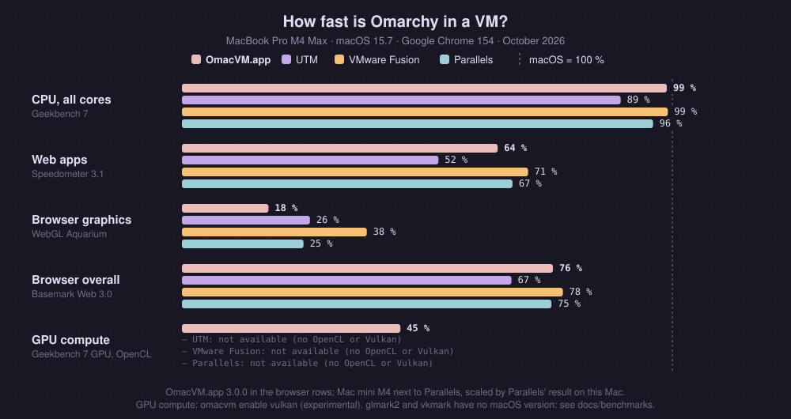

# Comparing the four apps

OmacVM builds the same Omarchy VM in OmacVM.app, UTM, VMware Fusion or
Parallels Desktop. Everything in [the feature list](features.md) works in all
four, except where the table says otherwise. The short version is the
[Which app?](../README.md#which-app) table in the README.

**Which one?**

- **OmacVM.app** (recommended): free, open source, nothing else to install,
  every display, and the only one with hardware video decoding.
- **UTM**: free and open source, one display.
- **VMware Fusion**: free, external displays, the longest battery life.
- **Parallels**: the least to set up and the fastest 3D, but paid.

Each app has its own page: [OmacVM.app](routes/app.md), [UTM](routes/utm.md),
[VMware Fusion](routes/vmware-fusion.md), [Parallels](routes/parallels.md).

## The full table

| | OmacVM.app | UTM 5 | VMware Fusion 26 | Parallels Desktop |
|---|---|---|---|---|
| **Best for** | nothing else to install | free and open source | free, external displays, battery | least to set up |
| Cost | **free**, open source | **free**, open source | **free**, also for work | paid |
| CPUs and memory per VM | **no cap** | **no cap** | **no cap** | Standard: 4 CPUs, 8 GB Pro or trial: more |
| **Speed** (the Mac itself = 100 %) | | | | |
| CPU, all cores: Geekbench 7 | **99 %** | 89 % | **99 %** | 96 % |
| CPU, one core: Geekbench 7 | **97 %** | 90 % | 93 % | **97 %** |
| Web apps: Speedometer 3.1 | 64 % | 52 % | **71 %** | 67 % |
| Animations in the browser: MotionMark 1.3.1 | no stable result | no stable result | **40 %** | no stable result |
| GPU, share of the Mac: Basemark Web 3.0 · WebGL Aquarium | 76 % · 18 % | 67 % · 26 % | **78 % · 38 %** | 75 % · 25 % |
| 3D: glmark2 (score) | 1017 (2.9.0 RC in a window: 2856) | 964 | 1813 | **7306** |
| **Graphics and video** | | | | |
| GPU path | virgl | virgl | vmwgfx, with a Hyprland fix OmacVM builds | virgl |
| GPU in Chrome, Chromium, Brave, Firefox | ✓ | ✓ | ✓ | ✓ |
| YouTube 4K at 60 fps | **✓ decoded by the Mac's media engine** in Google Chrome, Brave and Firefox ([which apps](video-decode.md)) | ✓ decoded by the CPU | ✓ decoded by the CPU | ✓ decoded by the CPU |
| GPU compute (Vulkan, OpenCL; Geekbench 7 GPU) | 45 %, with `omacvm enable vulkan` (experimental) | ✗ | ✗ | ✗ |
| **Battery** (power draw, and hours on a full 100 Wh battery) | | | | |
| Idle desktop | 6.2 W · 16 h | being re-measured | **5.5 W · 18 h** | 5.7 W · 18 h |
| Reading, scrolling a page | 6.8 W · 15 h | being re-measured | **5.9 W · 17 h** | 7.3 W · 14 h |
| YouTube 4K | 21.3 W · 4.7 h (old, CPU decoding) | 39.2 W · 2.6 h | **20.4 W · 4.9 h** | 24.2 W · 4.1 h |
| Every CPU core busy | 71 W · 1.4 h | 61 W · 1.6 h | 74 W · 1.4 h | 72 W · 1.4 h |
| **Displays** | | | | |
| External displays | **✓ every one, in your macOS arrangement** | ✗ one display | **✓ every one, in your macOS arrangement** | **✓ every one, in your macOS arrangement** |
| Native Retina, 120 Hz | ✓ | ✓ | ✓ | ✓ |
| Resolution changes | **live** | fixed at boot | **live** | **live** |
| **Mac integration** | | | | |
| Wi-Fi, Bluetooth, audio, Night Shift, True Tone, wallpaper (OmacVM Bridge) | ✓ installed, not fully tested yet | ✓ | ✓ | ✓ |
| Media keys, trackpad gestures, Cmd shortcuts | ✓ installed, not fully tested yet | ✓ | ✓ | ✓ |
| The bar beside the notch | ✓ built in | ✓ Omanotch | ✓ Omanotch | ✓ Omanotch |
| Copy and paste | ✓ | ✓ | ✓ when the pointer crosses the VM's edge | ✓ |
| The Mac's battery in the bar | ✓ built in | ✓ through OmacVM Bridge | ✓ through OmacVM Bridge | ✓ Parallels' own |
| The Mac's camera | ✓ built in | ✓ through OmacVM Bridge (installed for it also with the Bridge off) | ✓ through OmacVM Bridge (likewise) | ✓ Parallels' own |
| Sound and the Mac's microphone | ✓, the microphone once macOS allows OmacVM it | ✓ | ✓, the microphone once macOS allows Fusion it | ✓, the microphone once macOS allows Parallels it |
| **Setup** | | | | |
| Get it | `omacvm build --vm-type app`, or the zip from the releases | `brew install --cask utm@beta` | download after a Broadcom sign-in | buy it or start the trial |
| Before first use | allow Accessibility for OmacVM | start UTM from the Dock | allow Accessibility for Fusion | one Parallels setting |
| Where the VM goes | **any folder, external drives too** | UTM's own library | **any folder, external drives too** | **any folder, external drives too** |

  

## The Mac itself, and video

On the Mac itself, for the same loads: idle 6.1 W (16 h), reading 6.6 W
(15 h), YouTube 4K 8.0 W (12.5 h, in hardware), every core busy 75 W (1.3 h).

The difference for video is decoding: macOS decodes YouTube's 4K in hardware,
and Parallels, UTM and Fusion give Linux no hardware video decoding. OmacVM.app
does since 2.7.0: Google Chrome, Brave, Firefox (H.264 and VP9; AV1 in Chrome,
not yet in Firefox), mpv, FFmpeg and GStreamer apps decode on the Mac's media
engine. Omarchy's default Chromium (Arch Linux ARM) is built without VA-API;
it decodes H.264 and VP9 (YouTube) on the media engine through a V4L2 decoder
OmacVM adds to the VM (not in a release yet). OmacVM.app's YouTube 4K power
number above is from before, with the CPU decoding.
[How video decoding works](video-decode.md).

## How we measured

A MacBook Pro 16" M4 Max (macOS 15.7, 100 Wh battery), 16 CPUs and 48 GB per
VM, one VM at a time in full screen on the built-in display, nothing else
open, brightness at 50 %, Google Chrome 154 on the Mac and in each VM, OmacVM
2.3.0. Speedometer is the median of 3 runs, the rest single runs. Power is the
whole Mac's draw from its battery telemetry, 3 minutes per load; hours are
100 Wh over that draw, whole hours from 13 h up, one decimal below. The GPU
row is from 2026-10-04 (OmacVM 2.6.0, median of 3, brightness at its lowest,
an external display connected); on the Mac, Geekbench 7 GPU gives 204241 with
Metal and 117456 with OpenCL. OmacVM.app's Speedometer, Basemark and Aquarium
are 3.0.0's (2026-10-06): measured on a Mac mini M4 next to Parallels, each VM
alone in full screen, median of 3, then scaled by Parallels' result on the
MacBook ([how](benchmarks/README.md#omacvmapp-300-2026-10-06)).

Every step, the raw numbers and how to run the same tests yourself:
[benchmarks](benchmarks/README.md).

- **UTM's idle and reading numbers** are being measured again. Our run gave
  15 W at idle, but a later check showed about 5 W, so something was probably
  still busy in the VM during our run
  ([#32](https://github.com/gillesgoetsch/omacvm/issues/32)).
- **MotionMark** needs steady frame timing. On the three virgl routes Chrome's
  frames come too unevenly, so every subtest stays at its minimum; on Fusion
  it measures normally.

## About the Fusion route

Stock Omarchy shows a black screen on Fusion. Fusion's GPU driver (`vmwgfx`)
hands Hyprland buffers it can't release, so every app dies on its first frame.
OmacVM builds Hyprland with a one-file fix for that (by Pascal-0x90,
[hyprwm/Hyprland#12966](https://github.com/hyprwm/Hyprland/discussions/12966))
and builds it again after every Hyprland update. It also builds VMware Tools
itself, because Arch Linux ARM doesn't package them. They give you the display
layout and copy and paste. Everything about the route:
[routes/vmware-fusion.md](routes/vmware-fusion.md).
